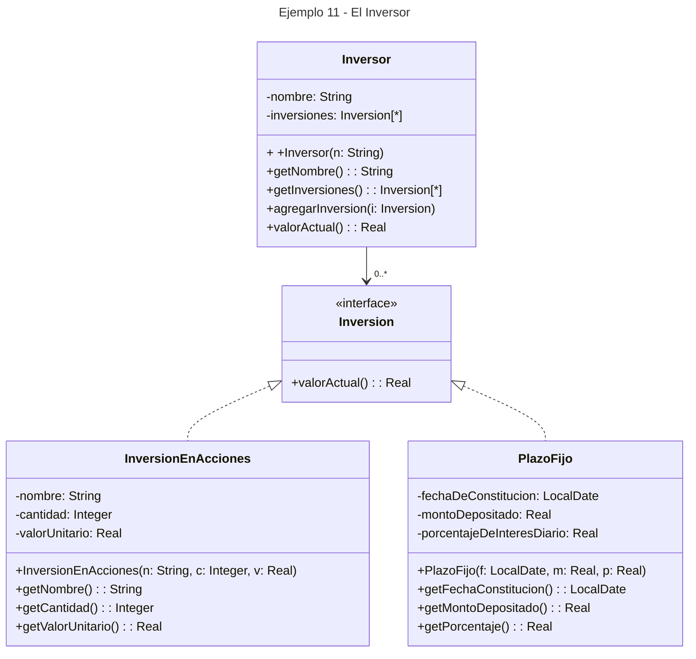

```mermaid
---
title: Ejemplo 11 - El Inversor
---
classDiagram
    Inversion <|.. InversionEnAcciones
    Inversion <|.. PlazoFijo
    Inversor -->"0..*" Inversion
    class Inversor {
        -nombre: String
        -inversiones: Inversion[*]
        +<create> +Inversor(n: String)
        +getNombre(): String
        +getInversiones(): Inversion[*]
        +agregarInversion(i: Inversion)
        +valorActual(): Real
    }

    class Inversion{
        <<interface>>
        +valorActual(): Real
    }
    class InversionEnAcciones {
        -nombre: String
        -cantidad: Integer
        -valorUnitario: Real
        <create> +InversionEnAcciones(n: String, c: Integer, v: Real)
        +getNombre(): String
        +getCantidad(): Integer
        +getValorUnitario(): Real
    }
    class PlazoFijo {
        -fechaDeConstitucion: LocalDate
        -montoDepositado: Real
        -porcentajeDeInteresDiario: Real
        <create> +PlazoFijo(f: LocalDate, m: Real, p: Real)
        +getFechaConstitucion(): LocalDate
        +getMontoDepositado(): Real
        +getPorcentaje(): Real
    }
```
