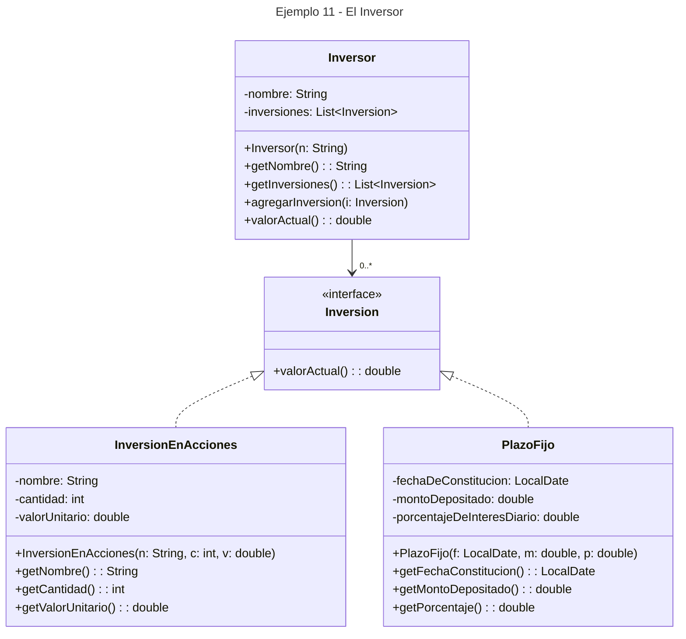

```mermaid
---
title: Ejemplo 11 - El Inversor
---
classDiagram
    Inversion <|.. InversionEnAcciones
    Inversion <|.. PlazoFijo
    Inversor -->"0..*" Inversion
    class Inversor {
        -nombre: String
        -inversiones: List~Inversion~
        <create> +Inversor(n: String)
        +getNombre(): String
        +getInversiones(): List~Inversion~
        +agregarInversion(i: Inversion)
        +valorActual(): double
    }

    class Inversion{
        <<interface>>
        +valorActual(): double
    }
    class InversionEnAcciones {
        -nombre: String
        -cantidad: int
        -valorUnitario: double
        <create> +InversionEnAcciones(n: String, c: int, v: double)
        +getNombre(): String
        +getCantidad(): int
        +getValorUnitario(): double
    }
    class PlazoFijo {
        -fechaDeConstitucion: LocalDate
        -montoDepositado: double
        -porcentajeDeInteresDiario: double
        <create> +PlazoFijo(f: LocalDate, m: double, p: double)
        +getFechaConstitucion(): LocalDate
        +getMontoDepositado(): double
        +getPorcentaje(): double
    }
```