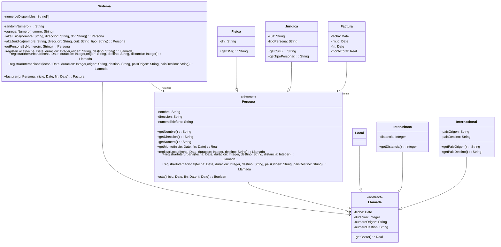

```mermaid
classDiagram

Sistema --> "* clientes" Persona
Sistema --> "* llamadas" Llamada

Fisica --|> Persona
Juridica --|> Persona

Persona --> "* llamadas" Llamada

Local --|> Llamada
Interurbana --|> Llamada
Internacional --|> Llamada

Factura --> "1 cliente" Persona

class Sistema {
  -numerosDisponibles: String[*]
  -randomNumero(): String
  +agregarNumero(numero: String)
  +altaFisica(nombre: String, direccion: String, dni: String): Persona
  +altaJuridica(nombre: String, direccion: String, cuit: String, tipo: String): Persona
  -getPersonaByNumero(n: String): Persona
  +registarLocal(fecha: Date, duracion: Integer,origen: String, destino: String): Llamada
  +registrarInterurbana(fecha: Date, duracion: Integer,origen: String, destino: String, distancia: Integer): Llamada
  +registrarInternacional(fecha: Date, duracion: Integer,origen: String, destino: String, paisOrigen: String, paisDestino: String): Llamada
  +facturar(p: Persona, inicio: Date, fin: Date): Factura
}

class Persona {
  -nombre: String
  -direccion: String
  -numeroTelefono: String
  +getNombre(): String
  +getDireccion(): String
  +getNumero(): String
  +getMonto(inicio: Date, fin: Date): Real
  +registarLocal(fecha: Date, duracion: Integer, destino: String): Llamada
  +registrarInterurbana(fecha: Date, duracion: Integer, destino: String, distancia: Integer): Llamada
  +registrarInternacional(fecha: Date, duracion: Integer, destino: String, paisOrigen: String, paisDestino: String): Llamada
  -esta(inicio: Date, fin: Date, f: Date): Boolean
}

class Llamada {
  -fecha: Date
  -duracion: Integer
  -numeroOrigen: String
  -numeroDestion: String
  +getCosto(): Real
}

class Fisica{
  -dni: String
  +getDNI(): String
}

class Juridica {
  -cuit: String
  -tipoPersona: String
  +getCuit(): String
  +getTipoPersona(): String
}

class Local

class Interurbana {
  -distancia: Integer
  +getDistancia(): Integer
}

class Internacional {
  -paisOrigen: String
  -paisDestino: String
  +getPaisOrigen(): String
  +getPaisDestino(): String
}

<<abstract>> Llamada
<<abstract>> Persona

class Factura {
  -fecha: Date
  -inicio: Date
  -fin: Date
  -montoTotal: Real
}

```
